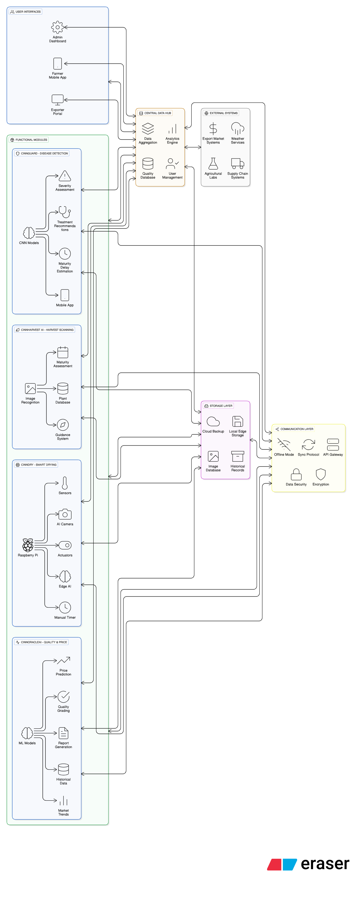

# CinnamonSri - Smart Cinnamon Industry Management System

A comprehensive mobile application built with React Native and Expo for managing the entire cinnamon production lifecycle in Sri Lanka. This system provides intelligent solutions for harvest monitoring, quality assessment, disease detection, and price prediction.



## 🌟 Overview

CinnamonSri is an all-in-one mobile platform designed to empower cinnamon farmers and producers in Sri Lanka with smart technology solutions. The application covers the entire value chain from harvest to market, providing AI-powered insights, quality assessment tools, and comprehensive management capabilities.

## 📱 Features

### 1. **CinnOracle** - Quality Assessment & Price Prediction
- Real-time market price tracking
- Quality prediction based on temperature and weight loss
- Historical trend analysis
- Batch management and reporting
- PDF and CSV export capabilities
- Quality grading system (Premium, Grade A, Grade B)

### 2. **CinnGuard** - Disease Detection & Prevention
- Camera-based disease scanning
- AI-powered illness detection
- Comprehensive prevention guides
- Scan history tracking
- Expert consultation integration

### 3. **CinnHarvest** - Harvest Management
- Harvest tracking and management
- Plant maturity monitoring
- Growth tips and best practices
- Plant history and records
- Harvest scheduling

## 🏗️ System Architecture

The application follows a modular architecture with separate modules for each major functionality:

```
CinnamonSriApp/
├── screens/
│   ├── CinnOracle/          # Quality & Price Prediction Module
│   ├── CinnGuard/           # Disease Detection Module
│   └── CinnHarvest/         # Harvest Management Module
├── components/              # Reusable UI components
├── hooks/                   # Custom React hooks
├── constants/               # App constants and themes
├── src/
│   └── api/                 # API client configuration
└── assets/                  # Images and static assets
```

## 📦 Dependencies

### Production Dependencies

```json
{
  "expo": "^54.0.0",
  "expo-status-bar": "~3.0.8",
  "nativewind": "latest",
  "react": "19.1.0",
  "react-native": "0.81.5",
  "react-native-reanimated": "~4.1.1",
  "react-native-safe-area-context": "~5.6.0",
  "react-native-worklets": "0.5.1"
}
```

### Development Dependencies

```json
{
  "@babel/core": "^7.20.0",
  "@types/react": "~19.1.10",
  "@react-native-community/cli": "latest",
  "eslint": "^9.25.1",
  "eslint-config-expo": "~10.0.0",
  "eslint-config-prettier": "^10.1.2",
  "prettier": "^3.2.5",
  "tailwindcss": "^3.4.0",
  "prettier-plugin-tailwindcss": "^0.5.11",
  "typescript": "~5.9.2"
}
```

## 🚀 Getting Started

### Prerequisites

Before you begin, ensure you have the following installed:

- **Node.js** (v18 or higher)
- **npm** or **yarn** package manager
- **Expo CLI** (optional, but recommended)
- **Android Studio** (for Android development)
- **Xcode** (for iOS development on macOS)

### Installation

1. **Clone the repository**
   ```bash
   git clone https://github.com/SalinduX/CinnamonSri-Smart-Cinnamon-Industry-Management-System.git
   cd CinnamonSri-Smart-Cinnamon-Industry-Management-System/CinnamonSriApp
   ```

2. **Install dependencies**
   ```bash
   npm install
   ```
   or
   ```bash
   yarn install
   ```

3. **Configure environment** (if needed)
   - Copy any environment configuration files
   - Update API endpoints in `src/api/client.ts`

## 🎯 Running the Application

### Development Mode

#### Start the Expo development server
```bash
npm start
```
or
```bash
yarn start
```

This will open the Expo DevTools in your browser. You can then:
- Press `a` to open on Android emulator
- Press `i` to open on iOS simulator
- Press `w` to open in web browser
- Scan the QR code with Expo Go app on your physical device

#### Run on Android
```bash
npm run android
```
or
```bash
yarn android
```

#### Run on iOS
```bash
npm run ios
```
or
```bash
yarn ios
```

#### Run on Web
```bash
npm run web
```
or
```bash
yarn web
```

### Build Commands

#### Prebuild (Generate native projects)
```bash
npm run prebuild
```

This generates the native iOS and Android projects from the Expo configuration.

### Code Quality

#### Linting
```bash
npm run lint
```

This will check your code for linting errors and formatting issues.

#### Format Code
```bash
npm run format
```

This will automatically fix linting errors and format your code according to the project's style guide.

## 📁 Project Structure

```
CinnamonSriApp/
├── app/                      # Expo Router app directory
│   ├── (tabs)/              # Tab navigation screens
│   ├── _layout.tsx          # Root layout
│   └── index.tsx            # Entry point
├── assets/                  # Static assets
│   ├── images/              # Image assets
│   └── system_overview_architecture.png.png
├── components/              # Reusable components
│   ├── ui/                  # UI components
│   ├── themed-text.tsx
│   ├── themed-view.tsx
│   └── ...
├── constants/               # Constants and configuration
│   └── theme.ts             # Theme configuration
├── hooks/                   # Custom React hooks
│   ├── use-color-scheme.ts
│   └── use-theme-color.ts
├── screens/                 # Feature modules
│   ├── CinnOracle/         # Quality & Price Prediction
│   │   ├── CinnOracleMain.tsx
│   │   ├── NewAnalysis.tsx
│   │   ├── PricePrediction.tsx
│   │   ├── HistoricalTrends.tsx
│   │   ├── SavedSuccess.tsx
│   │   └── Report.tsx
│   ├── CinnGuard/          # Disease Detection
│   │   ├── CinnGuardHome.tsx
│   │   ├── Camera.tsx
│   │   ├── Detection.tsx
│   │   ├── Guide.tsx
│   │   ├── Prevention.tsx
│   │   └── ScanHistory.tsx
│   └── CinnHarvest/        # Harvest Management
│       ├── HarvestHome.tsx
│       ├── Maturity.tsx
│       ├── TipsFollow.tsx
│       └── ViewHistory.tsx
├── src/
│   └── api/
│       └── client.ts        # API client configuration
├── scripts/
│   └── reset-project.js     # Project reset script
├── App.tsx                  # Main App component (if using React Navigation)
├── app.json                 # Expo configuration
├── package.json             # Dependencies and scripts
├── tsconfig.json            # TypeScript configuration
└── README.md                # This file
```

## 🎨 Technologies Used

- **React Native** - Mobile app framework
- **Expo** - Development platform and toolchain
- **TypeScript** - Type-safe JavaScript
- **NativeWind** - Tailwind CSS for React Native
- **React Native Reanimated** - Animations library
- **Expo Router** - File-based routing (optional)

## 🔧 Configuration

### TypeScript
The project uses TypeScript for type safety. Configuration is in `tsconfig.json`.

### ESLint & Prettier
Code formatting and linting rules are configured in:
- `eslint.config.js` - ESLint configuration
- Prettier configuration (in package.json)

### Expo Configuration
App configuration is in `app.json`, including:
- App name and version
- Icons and splash screens
- Platform-specific settings
- Plugins and experiments

## 📱 Platform Support

- ✅ **Android** - Full support
- ✅ **iOS** - Full support
- ✅ **Web** - Full support

## 🤝 Contributing

1. Fork the repository
2. Create your feature branch (`git checkout -b feature/AmazingFeature`)
3. Commit your changes (`git commit -m 'Add some AmazingFeature'`)
4. Push to the branch (`git push origin feature/AmazingFeature`)
5. Open a Pull Request

## 📝 Scripts Reference

| Command | Description |
|---------|-------------|
| `npm start` | Start Expo development server |
| `npm run android` | Run on Android emulator/device |
| `npm run ios` | Run on iOS simulator/device |
| `npm run web` | Run in web browser |
| `npm run prebuild` | Generate native iOS/Android projects |
| `npm run lint` | Check code for linting errors |
| `npm run format` | Format code with ESLint and Prettier |

## 📄 License

This project is private and proprietary.

## 👥 Authors

- **CinnamonSri Development Team**

## 📞 Support

For support, email support@cinnamonsri.com or open an issue in the repository.

## 🙏 Acknowledgments

- Sri Lankan Cinnamon Industry
- All contributors and farmers who provided feedback
- Expo team for the excellent development platform

---

**Last Updated:** January 2026
